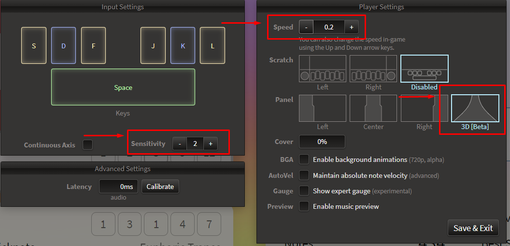

A simple bot to play **Bemuse**, a browser-based rythm game.

**Game Link:** https://bemuse.ninja/

# Setting The Game Up

# Getting Started

Run with Python 3.7 (**important!**)

Installing dependencies:

- `pip install -r requirements.txt`
- `pip install pypiwin32`

Running:

- `python pianoBot.py`

## Tip

You can create an independent virtual environment to install the dependencies and run the bot:

Installing `virtualenv`:

- `pip install virtualenv`

Creating a virtual environment (inside the repository folder):

- `virtualenv <env_name>`

Activating the environment:

- `./<env_name>/Scripts/activate`
